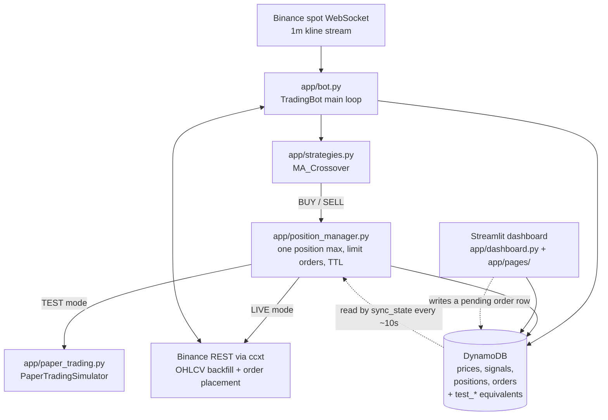

# trading-bot-aws

A single-symbol crypto trading bot for Binance spot, with a Streamlit dashboard and DynamoDB
persistence, deployed to one EC2 instance by the scripts in `deployment/`. It streams 1-minute
klines, runs a moving-average crossover strategy, and either simulates fills against a paper
balance (`TEST` mode) or places real limit orders on Binance (`LIVE` mode).

**Status: working prototype / personal project.** It runs end to end and has been deployed to
EC2, but it is not production-hardened: there is exactly one strategy, the dashboard has no
authentication, dependencies are unpinned, and 2 of the 3 unit tests currently fail. See
[Known issues](#known-issues) before running it with real money.

---

## How it works

The system is two long-running processes on one EC2 instance that talk to each other only
through DynamoDB.

**The bot** (`app/bot.py`) backfills 500 candles over the ccxt REST API, then subscribes to
the Binance spot kline WebSocket. Every tick it writes the live candle to the prices table; on
each candle *close* it recomputes indicators and asks each enabled strategy for a signal. A
signal goes to `PositionManager`, which enforces the risk rules (at most one open position,
limit orders only, orders expire after a TTL) and then routes the order either to the in-process
paper simulator or to the real exchange, depending on `trading.mode` in `config.json`. Its main
loop wakes every 10 seconds to sync state, check fills, expire stale orders and update P&L.

**The dashboard** (`app/dashboard.py` plus `app/pages/`) is a Streamlit multipage app. It is
read-only over DynamoDB for most views, but it also acts as a manual trading control: pressing
buy/sell writes a row with `status: pending` into the orders table, and the bot picks it up on
its next `sync_state()` pass. Closing a position works the same way — the dashboard flips the
position's status to `request_close` and the bot acts on it.



### Modes

`trading.mode` in `config.json` selects the behaviour, and also selects which DynamoDB tables
are used:

| Mode | Orders | Tables | Balance |
|---|---|---|---|
| `TEST` | Simulated by `PaperTradingSimulator`. An order fills as soon as the live price crosses its limit. | `TradingBot_Test_*` | Virtual, seeded from `trading.test_initial_balance` |
| `LIVE` | Real `create_limit_order` calls through ccxt | `TradingBot_Positions` / `TradingBot_Orders` | Your actual Binance balance |

Market data comes from Binance **mainnet** in both modes — `TEST` only simulates the fills, it
does not use the Binance testnet.

### The strategy

`MA_Crossover` is the only strategy implemented. It computes two SMAs over the close price and
returns `BUY` when the short SMA crosses above the long one and `SELL` when it crosses below.
`StrategyRegistry` in `app/strategies.py` is the extension point: subclass `BaseStrategy`, add
the class to `StrategyRegistry._strategies`, and enable it in `config.json`.

Position sizing is deliberately minimal: `calculate_position_size()` returns the exchange's
*minimum* order amount for the symbol. `trading.risk_per_trade` is present in the config but is
read into the bot and not currently used for sizing.

---

## Requirements

- Python 3 (the repo does not pin a version; it was deployed against the system `python3` on
  Amazon Linux 2023)
- An AWS account, with credentials available to boto3 — `~/.aws/credentials`, environment
  variables, or the EC2 instance role created by `deployment/attach_iam.py`
- A Binance account and API key/secret

Dependencies (`requirements.txt`, unpinned):

```
boto3  ccxt  pandas  ta  streamlit  python-dotenv  plotly  binance-connector  Jinja2
```

## Setup

```bash
git clone https://github.com/chinthakat/trading-bot-aws.git
cd trading-bot-aws

python -m venv .venv
source .venv/bin/activate        # Windows: .venv\Scripts\activate
pip install -r requirements.txt

cp .env.example .env             # then edit .env with your Binance key and secret
```

Create the DynamoDB tables (this also creates the security group and launches the EC2 instance —
see [docs/deployment.md](docs/deployment.md) if you only want the tables):

```bash
python deployment/provision.py            # core tables + security group + EC2 instance
python deployment/create_position_tables.py
python deployment/create_test_tables.py
```

## Usage

All commands are run **from the repository root** — the bot, the dashboard and the scripts in
`scripts/` all resolve `config.json` and their log files relative to the current working
directory.

Run the bot:

```bash
python app/bot.py
```

Run the dashboard (defaults to port 8501):

```bash
streamlit run app/dashboard.py
```

Deploy to the EC2 instance and restart the dashboard service:

```bash
python deployment/deploy.py     # scp app/, config.json, requirements.txt, .env; then restart
python deployment/restart.py    # restart the bot process over SSH
python deployment/teardown.py   # terminate the instance and delete the tables
```

The bot writes `bot.log`, `api_logs.txt` and `ws_debug.log` into its working directory. The
dashboard's *API Logs* page tails `api_logs.txt`, so the two processes need the same working
directory for that page to show anything.

## Configuration

### Environment variables

Read directly from the environment (loaded from `.env` by `python-dotenv`). See `.env.example`.

| Variable | Read by | Purpose |
|---|---|---|
| `BINANCE_API_KEY` | `app/bot.py`, `app/pages/live_chart.py` | Binance API key passed to ccxt |
| `BINANCE_SECRET` | `app/bot.py`, `app/pages/live_chart.py` | Binance API secret passed to ccxt |
| `AWS_ACCESS_KEY_ID` | boto3 | Optional; omit when using `~/.aws/credentials` or an instance role |
| `AWS_SECRET_ACCESS_KEY` | boto3 | Optional, as above |
| `AWS_DEFAULT_REGION` | boto3 | Optional; the code passes the region from `config.json` explicitly |

### config.json

| Key | Default in repo | Meaning |
|---|---|---|
| `aws.region` | `ap-southeast-2` | Region for DynamoDB and EC2 |
| `aws.tables.*` | `TradingBot_*` | DynamoDB table names. `prices`, `signals`, `positions`, `orders` and the `test_*` tables are actively used. `trades` is only ever read, `stats` is connected but never touched, and `logs` is read nowhere at all |
| `exchange.id` | `binance` | ccxt exchange id |
| `exchange.testnet` | `false` | Puts ccxt in sandbox mode. Note: the WebSocket URL is hardcoded to mainnet regardless (see [Known issues](#known-issues)) |
| `exchange.options` | spot, time-adjust | Passed straight to the ccxt constructor |
| `trading.mode` | `TEST` | `TEST` for simulated fills, `LIVE` for real orders |
| `trading.test_initial_balance` | `10000.0` | Starting paper balance in `TEST` mode |
| `trading.symbols` | `["BTC/USDT"]` | Symbols to stream and trade |
| `trading.base_currency` | `USDT` | Quote currency; read but not used for sizing |
| `trading.risk_per_trade` | `10.0` | Read into the bot but not currently applied — sizing uses the exchange minimum |
| `trading.interval` | `1m` | Kline interval for the WebSocket stream and backfill |
| `trading.active_strategies` | `MA_Crossover` enabled, `short_period` 5, `long_period` 20 | Which strategies run and with what parameters. The dashboard sidebar edits this and writes `config.json` back |
| `trading.risk_management.max_positions` | `1` | Maximum concurrent positions |
| `trading.risk_management.use_min_quantity` | `true` | Size orders at the exchange minimum |
| `trading.risk_management.order_ttl` | `300` | Seconds before an unfilled limit order is cancelled |
| `trading.risk_management.max_slippage_pct` | `0.5` | Read from config; not currently enforced anywhere in the order path |
| `trading.manual_trading_enabled` | `true` | Gates the manual buy/sell controls on the live chart page |

Secrets never belong in `config.json` — it is committed, and the dashboard rewrites it.

## Project layout

```
app/                      The bot and the dashboard
  bot.py                  Entry point: backfill, WebSocket loop, signal -> trade
  strategies.py           BaseStrategy, MaCrossoverStrategy, StrategyRegistry
  position_manager.py     Risk rules, order placement, fill tracking, DB sync
  paper_trading.py        Virtual balance and fill simulation for TEST mode
  persistence.py          DynamoManager: every DynamoDB read and write
  dashboard.py            Streamlit entry point: strategy config, trades, price chart
  page_utils.py           Shared render helpers for the account pages
  pages/                  Streamlit multipage views
    live_chart.py         Candle chart with signal markers and manual trade controls
    test_account.py       Paper-trading account view
    live_account.py       Live account view
    api_logs.py           Tails api_logs.txt
deployment/               boto3 scripts: provision, deploy, restart, teardown, table admin
  user_data.sh            EC2 bootstrap; installs Python and writes the two systemd units
scripts/                  One-off operational and debugging scripts (see scripts/README.md)
tests/                    Unit tests
docs/                     Deployment guide and the original requirements document
config.json               Runtime configuration (committed, no secrets)
```

## Documentation

- [docs/deployment.md](docs/deployment.md) — provisioning, deploying and tearing down the AWS
  side, both automated and by hand.
- [docs/requirements-spec.txt](docs/requirements-spec.txt) — the original requirements document
  the project was built from, kept verbatim. It is a statement of intent, not a description of
  what exists: several things in it (external signal ingestion, per-algo stats, Secrets Manager
  for API keys, CloudWatch alarms, multiple strategies) were never built.
- [scripts/README.md](scripts/README.md) — what each one-off script does and which ones mutate
  live data.

## Tests

Three `unittest` tests cover the MA crossover strategy:

```bash
python -m unittest discover -s tests
```

**Two of them currently fail.** `test_buy_signal` and `test_sell_signal` build a 7-candle price
series and assert a signal on the final candle, but with `short_period=2` / `long_period=5` the
crossover actually happens one candle earlier, so `calculate()` returns `None` at the last row.
The fixtures need fixing, not the strategy. There is no CI configured.

## Known issues

Found by reading the code; none of them have been fixed here.

- **`app/bot.py` defines `on_error` twice.** The second definition wins, and it appends to the
  hardcoded absolute path `/home/ec2-user/trading-bot/ws_debug.log`. Any WebSocket error on a
  machine that is not the EC2 host raises inside the error handler.
- **`exchange.testnet` does not reach the WebSocket.** `setup_exchange()` computes a testnet
  stream URL, but `start_websocket()` hardcodes `wss://stream.binance.com:9443`, so market data
  is always mainnet.
- **`DynamoManager.update_order()` always writes to the live orders table**, unlike its
  siblings which take a `mode` argument. `scripts/verify_full_lifecycle.py` was written to
  investigate exactly this.
- **The dashboard has no authentication**, and `deployment/provision.py` opens ports 22 and 8501
  to `0.0.0.0/0`. Anyone who finds the instance's public IP can place manual trades on it.
- **Nothing ever writes to the trades table.** `DynamoManager.log_trade()` exists but is not
  called from anywhere, so the dashboard's "Recent Trades" panel is always empty. Executed
  trades are only visible as positions and orders on the account pages.
- **The main dashboard page's "Total PnL" is hardcoded to `$0.00`.** Real P&L lives on the
  Test Account and Live Account pages, which compute it from the positions tables.
- **Dependencies are unpinned**, so a fresh install may not reproduce a working environment.
- `deployment/provision.py` writes the generated EC2 private key to the repository root as
  `TradingBotKey_AU.pem`. It is covered by `.gitignore`, but keep it out of the repo.

## Risk and disclaimer

This is experimental software for learning purposes. **It is not financial advice.**

Trading cryptocurrency risks the loss of your entire balance. In `LIVE` mode this bot places
real orders against your real Binance account with no human confirmation step, using a strategy
that has not been backtested anywhere in this repository. The `TEST` mode simulator fills orders
optimistically at the limit price with no fees, no slippage and no partial fills, so its results
will be more favourable than reality.

Run in `TEST` mode, or against Binance's testnet, until you fully understand the behaviour. Use
API keys scoped to trading only, never with withdrawal permission. You alone are responsible for
anything this code does with your money.

## License

MIT — see [LICENSE](LICENSE).
